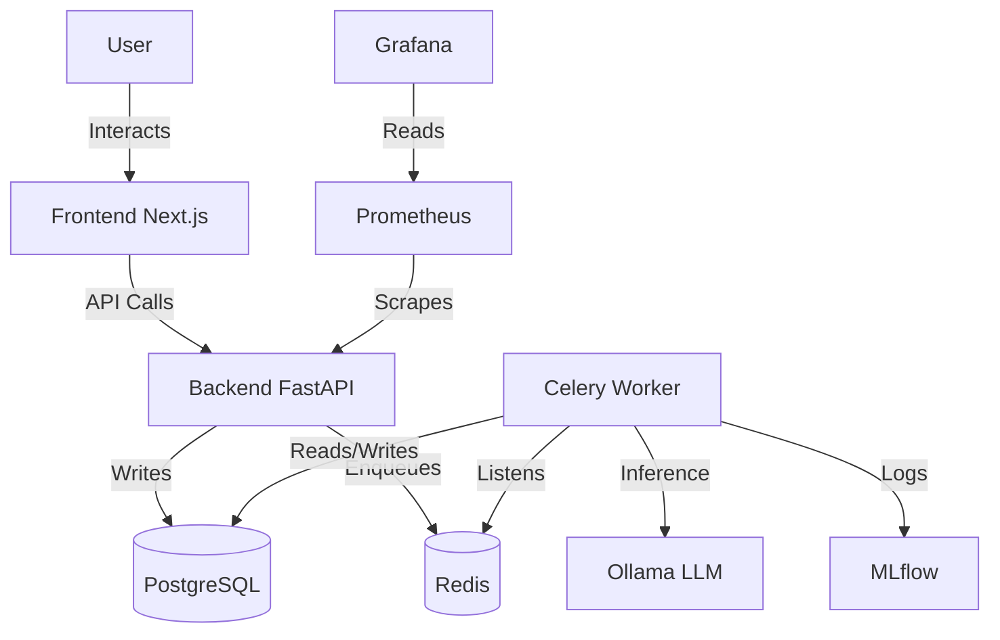

# Architecture Overview

AgentForge-XT is designed as a modular, event-driven microservices architecture. It separates the concerns of agent design (Frontend), API management (Backend), and agent execution (Workers).

## High-Level Diagram

## Components

### 1. Frontend (Next.js 15)
- **Role**: Provides the User Interface for designing graphs, managing agents, and viewing runs.
- **Key Tech**: React Flow (Graph Canvas), Tailwind CSS (Styling), React Query (State).
- **Hosting**: Deployed as a standalone Node.js container or static export (if applicable).

### 2. Backend (FastAPI)
- **Role**: REST API gateway. Handles CRUD operations, authentication (stub), and task dispatching.
- **Key Tech**: Pydantic (Validation), SQLAlchemy (ORM).
- **Observability**: Exposes `/metrics` for Prometheus and OTel traces.

### 3. Execution Engine (Celery + LangGraph)
- **Role**: The "Brain". Picks up tasks from Redis, compiles the JSON graph into a `LangGraph` state machine, and executes it.
- **Resilience**: Asynchronous execution means the API never hangs while an agent is thinking.
- **AI Integration**: Connects to local Ollama instances or external APIs.

### 4. Persistence & State
- **PostgreSQL**: Stores relational data (Agents, Users, Run History).
- **Redis**: Acts as the message broker for Celery and potentially a caching layer.
- **MLflow**: Specialized storage for LLM traces, prompts, and experiment tracking.
